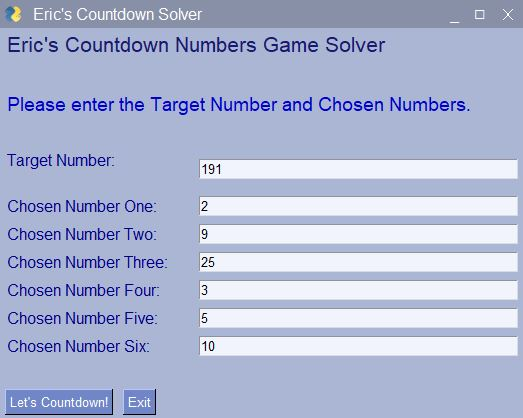

# Python_GUI_Countdown_Solver
Python_GUI_Countdown_Solver is a graphical Python app that brute forces every possible arithmetical operation on a set of six random numbers in order to sum to the exact value of another randomly selected three digit number, then returns every possible correct answer.

"Countdown" is a UK game show, part of which is a numbers game. The rules are simple: one player chooses six numbers at random from two piles -- one contains only the numbers one through ten, and the other comprises only the numbers twenty five, fifty, seventy five, and one hundred. A three digit target number is randomly produced and all of the players must attempt to get to that target number mathematically using the numbers they chose and the [*][/][+][-] operators. 

<table>
  <tr>
    <th> </th>
    <th>   </th>
    <th> </th>
  </tr>
  </table>

So, why do this? Well, I like Countdown and I like Python. 😋

Seriously, I wanted to start learning a new Python library called *"PySimpleGUI"*, which wraps tkinter, Qt (pyside2), wxPython and Remi (*for browser support*), allowing very fast GUI prototyping. If you have ever used tkinter you know it is syntactically difficult and thus probably see why someone basically wrote a markdown language to interface with it.